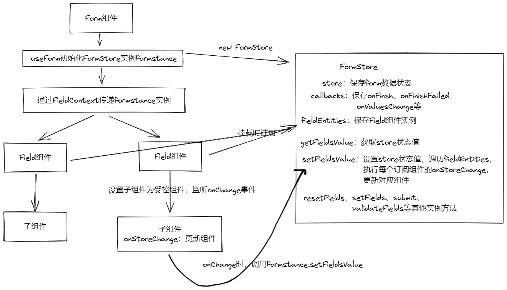

# Antd4.0 Form表单组件实现思路
antd4.0 Form表单主要是基于rc-filed-form组件的封装，rc-field-form源码地址：https://github.com/react-component/field-form  具体的源码就不细看了，直接进入正题。

如果我们自己实现表单是可能是这样：
```js
const FormModule = () => {
  const [formData, setFormData] = useState({
    name: '',
    age: null,
  });
  return (
    <form>
      <input
        placeholder="name"
        value={formData.name}
        onChange={e => {
          setFormData(prev => ({ ...prev, name: e.target.value }));
        }}
      ></input>
      <input
        placeholder="age"
        value={formData.name}
        onChange={e => {
          setFormData(prev => ({ ...prev, name: e.target.value }));
        }}
      ></input>
    </form>
  );
};
```
思路就是：
  + 初始化formData作为表单的状态存储
  + 将每个表单设置为受控组件，value取formData的值，监听onChange事件去改变fromData状态，即setFormData去更新数据和组件  
      
既然要将每个表单都设置为受控组件，但每次去写value 和 onChange太麻烦，可以封装一个Field组件，将Field的子元素组件设置为受控组件
```js
const Field = (props) => {
  const { children, setFormData, name, formData } = props;
  const getControlled = () => {
    return {
      value: formData[name],
      onChange: (e) => {
        const newValue = e.target.value;
        setFormData((prev => ({...prev, [name]: newValue})));
      },
    };
  }
  const returnChildNode = React.cloneElement(children, getControlled());
  return returnChildNode;
}

```
优化后为
```js
const FormModel = () => {
  const [formData, setFormData] = useState({
    name: '',
    age: null,
  });
  return (
    <form>
      <Field name="name" form={formData} setFormData={setFormData}>
        <input placeholder="name"></input>
      </Field>
      <Field name="age" form={formData} setFormData={setFormData}>
        <input placeholder="age"></input>
      </Field>
    </form>
  );
};
```
看着代码干净了点，不过每次都传formData和setFormData也太麻烦了，并且Field组件可能也是嵌套在子组件里，如果嵌套层级比较深，就得一直传props到Field组件，可以用Context来优化
```js
const FieldContext = React.createContext({});
class Field2 extends React.Component {
  static contextType = FieldContext;
  getControlled = () => {
    const { name } = this.props;
    const { formData, setFormData } = this.context;
    return {
      value: formData[name],
      onChange: e => {
        const newValue = e.target.value;
        setFormData((prev) => ({ ...prev, [name]: newValue }));
      },
    };
  };
  render() {
    const { children } = this.props;
    const returnChildNode = React.cloneElement(children, this.getControlled());
    return returnChildNode;
  }
}
const FormModel3 = () => {
  const [formData, setFormData] = useState({
    name: '',
    age: null,
  });
  return (
    <form>
      <FieldContext.Provider value={{ formData, setFormData }}>
        <Field name="name">
          <input placeholder="name"></input>
        </Field>
        <Field name="age">
          <input placeholder="age"></input>
        </Field>
      </FieldContext.Provider>
    </form>
  );
};

```

这样代码看着就舒服多了，但是性能方面还能优化一下，比如无论是修改了name还是age，都是执行最上层的setFromData，都会导致整个form更新，如果有大量表单项时则会出现性能问题。  
可以学习下antd4.0 Form表单(即rc-field-form)的实现思路，用一个数据仓库去管理 form 的状态store，然后表单组件通过订阅store，在store更新时，让每个订阅的表单去执行更新
## rc-field-form 主要实现思路
+ 用数据仓库FormStore管理数据
+ 通过Context跨层级传递store实例，让每个表单可以通过store实例去修改、获取数据
+ 在表单组件挂载的时候，将组件实例存入 store 订阅列表里，当数据变化时通知订阅列表的所有组件去更新
+ 将表单组件的子元素设置为受控组件，onChange时去改变数据仓库 store 的数据

## 简单实现
### 总体思路

### 实现数据仓库FormStore
+ 1、store存储数据，setFieldsValue、getFieldValue来设置、获取数据。当setFieldsValue设值时，遍历执行订阅组件实例的onStoreChange
+ 2、fieldEntities存储表单实例，订阅数据变化，当数据变化时，执行表单实例的onStoreChange方法
+ 3、callbacks用于存储onFinish、onFinishFailed等回调函数
```js
class FormStore {
  private store:Store = {}
  private fieldEntities: FieldEntity[] = []
  private callbacks: Callbacks = {};
  registerField = (fieldEntities: FieldEntity) => {
    this.fieldEntities.push(fieldEntities)
  }
  getFieldValue = (name: string) => {
    return this.store[name]
  }
  getFieldsValue = () => {
    return {...this.store}
  }
  
  setFieldsValue = (newStore: Store) => {
    const prevStore = {...this.store}
    this.store = {
      ...this.store,
      ...newStore
    }
    // 遍历订阅组件，执行组件的onStoreChange
    this.fieldEntities.forEach((entity) => {
      entity?.onStoreChange(prevStore);
    })
  }
  submit = () => {
    const { onFinish } = this.callbacks
    if(onFinish) {
      onFinish({...this.store})
    }
  }
  setCallbacks = (callbacks: Callbacks) => {
    this.callbacks = callbacks;
  };
  // 暴露实例方法
  getForm = () => {
    return {
      getFieldValue: this.getFieldValue,
      getFieldsValue: this.getFieldsValue,
      setFieldsValue: this.setFieldsValue,
      registerField: this.registerField,
      setCallbacks: this.setCallbacks,
      submit: this.submit
    }
  }
}
```
通过useForm创建store实例，如果已经创建则返回已创建的实例
```js
function useForm<Values = any>(form?: FormInstance<Values>): [FormInstance<Values>] {
  const formRef = useRef<FormInstance>();
  if (!formRef.current) {
    if (form) {
      formRef.current = form;
    } else {
      const store = new FormStore();
      formRef.current = store.getForm();
    }
  }
  return [formRef.current];
}
```
### 创建FieldContext
```js
const FieldContext = React.createContext<FormInstance>({
  getFieldValue: name => {},
  setFieldsValue: store => {},
  registerField: (fieldEntities: FieldEntity) => {},
  submit: () => {},
  setCallbacks: (callbacks: Callbacks) => {},
});
export default FieldContext;
```
### 实现Form组件
Form组件
+ 初始化store实例，并通过FieldContext.Provider传递给子组件
+ 设置store实例的回调函数，如onFinis、onFinishFailed等
+ 设置store的初始化值
+ 表单提交时，调用store实例的submit方法
```js
const Form: React.FC<FormProps> = props => {
  const { initialValues, onFinish, onFinishFailed, form } = props;
  const [formInstance] = useForm(form);
  formInstance.setCallbacks({
    onFinish,
    onFinishFailed,
  });
  if (initialValues) {
    formInstance.setFieldsValue(initialValues);
  }
  return (
    <form
      onSubmit={(event: React.FormEvent<HTMLFormElement>) => {
        event.preventDefault();
        event.stopPropagation();
        formInstance.submit();
      }}
    >
      <FieldContext.Provider value={formInstance}>{props.children}</FieldContext.Provider>
    </form>
  );
};
export default Form;
```
### 实现表单组件Field
+ 通过FieldContext获取实例及其方法
+ 表单挂载时，将组件实例注册到store的订阅列表，为表单订阅store数据变化
+ 将表单的子组件转为受控组件，添加onChange事件，通过store实例去设置数据
```js
class Field extends React.Component<FieldProps, FieldState> {
  static contextType = FieldContext;
  componentDidMount() {
    const { registerField } = this.context;
    registerField(this);
  }
  onStoreChange = (prevStore: Store) => {
    const { getFieldValue } = this.context;
    const { name } = this.props;
    const prevValue = prevStore[name];
    const curValue = getFieldValue(name);
    if (curValue !== prevValue) {
      this.forceUpdate();
      return;
    }
  };
  getControlled = () => {
    const { name } = this.props;
    const { getFieldValue, setFieldsValue } = this.context;
    return {
      value: getFieldValue(name),
      onChange: (e: React.ChangeEvent<HTMLInputElement>) => {
        const newValue = e.target.value;
        setFieldsValue({
          [name]: newValue,
        });
      },
    };
  };
  render() {
    const { children } = this.props;
    const returnChildNode = React.cloneElement(children as ReactElement, this.getControlled());
    return returnChildNode;
  }
}
export default Field;
```

### 接口文件
```js
export type StoreValue = any;
export type Store = Record<string, StoreValue>;
export interface FieldEntity {
  onStoreChange: (prevStore: Store) => void;
}
export interface FieldData {
  touched: boolean;
  validating: boolean;
  errors: string[];
  warnings: string[];
  value: StoreValue;
}
export type InternalNamePath = (string | number)[];
export interface ValidateErrorEntity<Values = any> {
  values: Values;
  errorFields: { name: InternalNamePath; errors: string[] }[];
  outOfDate: boolean;
}
export interface Callbacks<Values = any> {
  onValuesChange?: (changedValues: any, values: Values) => void;
  onFieldsChange?: (changedFields: FieldData[], allFields: FieldData[]) => void;
  onFinish?: (values: Values) => void;
  onFinishFailed?: (errorInfo: ValidateErrorEntity<Values>) => void;
}
export type NamePath = string;
export interface FormInstance<Values = any> {
  submit: () => void;
  setCallbacks: (callbacks: Callbacks) => void;
  getFieldValue: (name: NamePath) => StoreValue;
  setFieldsValue: (values: Partial<Values>) => void;
  registerField: (fieldEntities: any) => void;
}

export interface FieldProps {
  name: string;
}
export interface FieldState {}

export type BaseFormProps = Omit<React.FormHTMLAttributes<HTMLFormElement>, 'onSubmit'>;
export interface FormProps<Values = any> extends BaseFormProps {
  initialValues?: Store;
  form: FormInstance<Values>;
  onFinish: (values: any) => void;
  onFinishFailed: (error: any) => void;
}

```